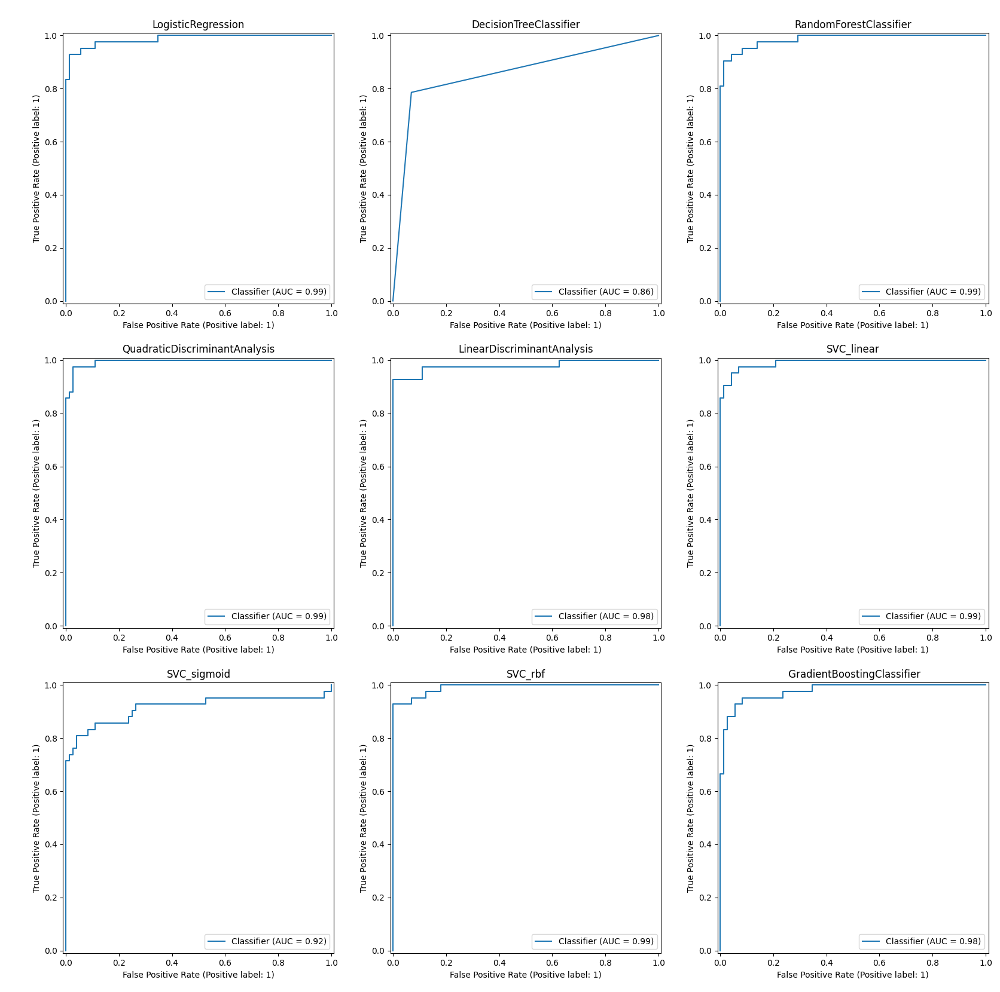
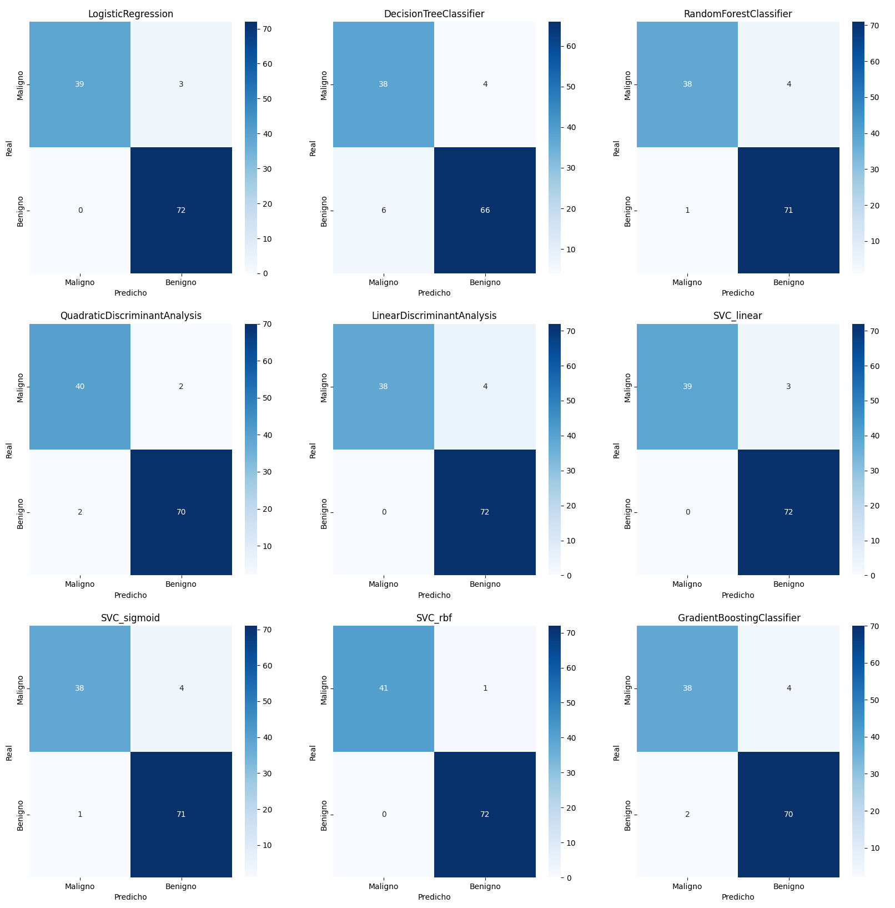
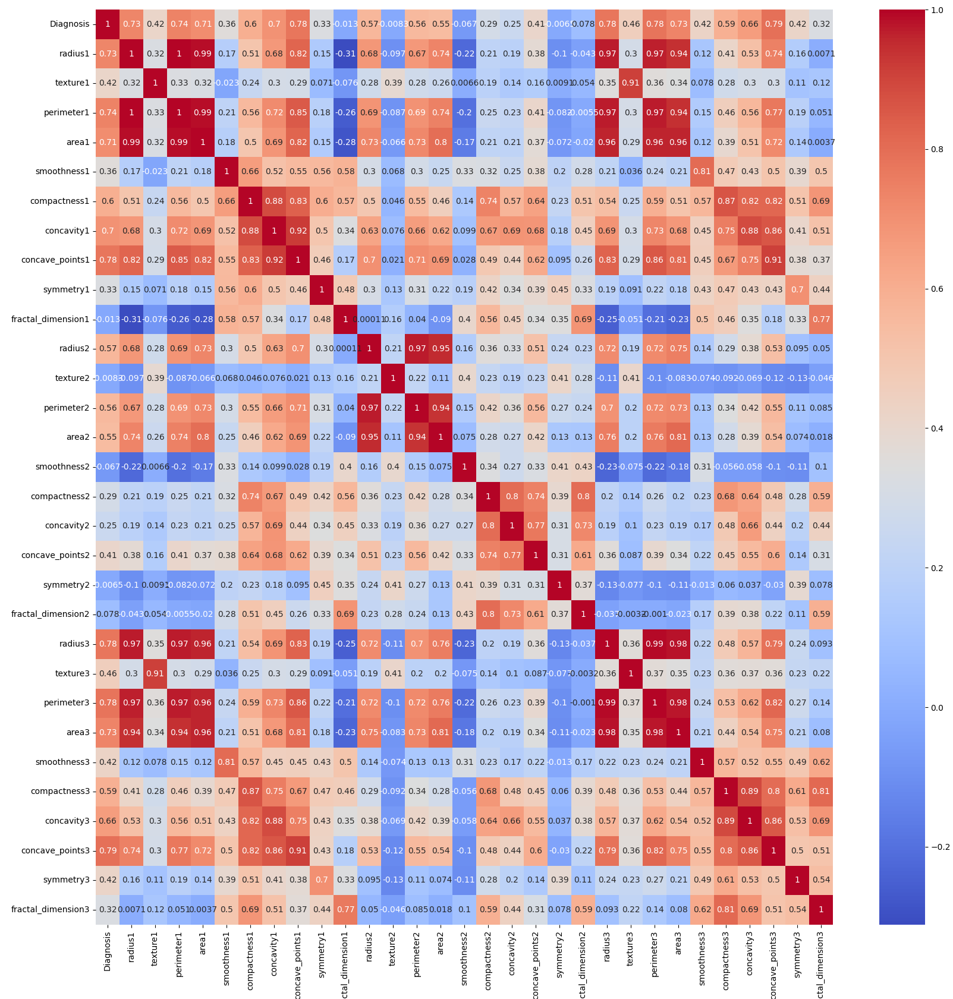
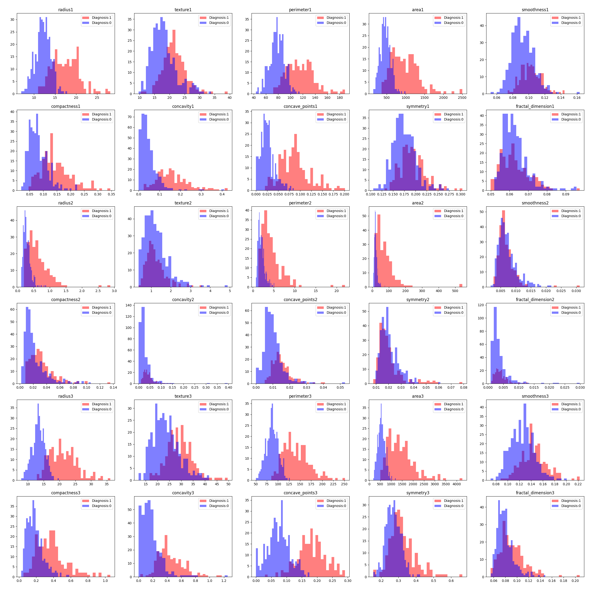

# Implementación de múltiples modelos para la detección del cáncer de mama  
### Un enfoque práctico mediante Python y técnicas de aprendizaje supervisado  
**Autores:** Maximiliano Angelini – Andrés Miranda  
**Departamento de Matemáticas, UTFSM**

---

## 📄 Poster del Proyecto

  

👉 *Haz clic sobre la imagen para ver el poster completo en PDF.*

---

## 📌 Descripción del proyecto

Este repositorio contiene el código, figuras y resultados del estudio aplicado al  
**Breast Cancer Wisconsin Diagnostic Dataset**, un conjunto de datos clásico para la clasificación de tumores *benignos* y *malignos*.

El objetivo del proyecto es:

- Analizar la estructura del dataset mediante técnicas exploratorias  
- Reducir dimensionalidad seleccionando covariables clave  
- Entrenar múltiples modelos de clasificación  
- Comparar su rendimiento usando validación cruzada y métricas ROC  
- Elegir un modelo final con alta precisión e interpretabilidad clínica

El trabajo completo está resumido en el poster del curso MAT281 – Aplicaciones de la Matemáticas en Ingeniería.

---

## 🧬 Dataset

Se utiliza el **Breast Cancer Wisconsin Diagnostic Dataset**, el cual contiene:

- **569 observaciones**
- **30 atributos cuantitativos** derivados de imágenes digitales de núcleos celulares

Las covariables describen forma, textura e irregularidad celular, permitiendo diferenciar tumores:

- **Benignos:** más regulares, variabilidad baja  
- **Malignos:** estructuras irregulares, mayor dispersión  

---

## 🔍 Análisis Exploratorio

Incluye:

- Matriz de correlación  
- Histogramas por covariable  
- Análisis de Componentes Principales (PCA)

Principales hallazgos:

- Alta colinealidad entre *radius*, *area*, *perimeter*, *concave points*, *compactness* y *concavity*  
- La **primera componente principal** explica ≈ **44 %** de la variabilidad  
- Las **primeras 10 componentes** explican ≈ **95 %**

Esto motiva la **reducción de dimensionalidad**, manteniendo variables esenciales como *radius* y *concave points*.

---

## 🧠 Modelos Implementados

Se evaluaron los siguientes modelos clásicos de clasificación:

- Logistic Regression  
- Decision Tree  
- Random Forest (200 trees)  
- Quadratic Discriminant Analysis  
- Linear Discriminant Analysis  
- SVC (linear, sigmoid, rbf)  
- GradientBoostingClassifier (100 estimadores, depth=3)

La evaluación se realizó mediante **Validación Cruzada**.

---

## 📊 Resultados Principales

- Todos los modelos obtienen *alta precisión*, donde el mayor AUC ≈ **0.99**  
- La fuerte separabilidad entre clases permite simplificar el modelo sin perder rendimiento  
- Modelos lineales —especialmente **Regresión Logística** y **SVM lineal**— destacan por su estabilidad y claridad interpretativa

Para el conjunto de prueba (80/20), la **Regresión Logística (Data 1)** obtiene:

- **Sensibilidad:** 92.86 %  
- **Especificidad:** 100 %  

---

## 🖼️ Resultados Visuales

A continuación se presentan las figuras más relevantes generadas durante el análisis.

---

### 🔹 Curvas ROC por modelo

  

---

### 🔹 Matrices de Confusión

  

---

### 🔹 Matriz de Correlación

  

---

### 🔹 Histogramas por Covariable

  

---

### 🔹 Componentes Principales (PCA)

  

---
